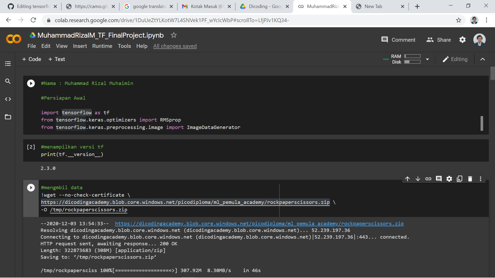
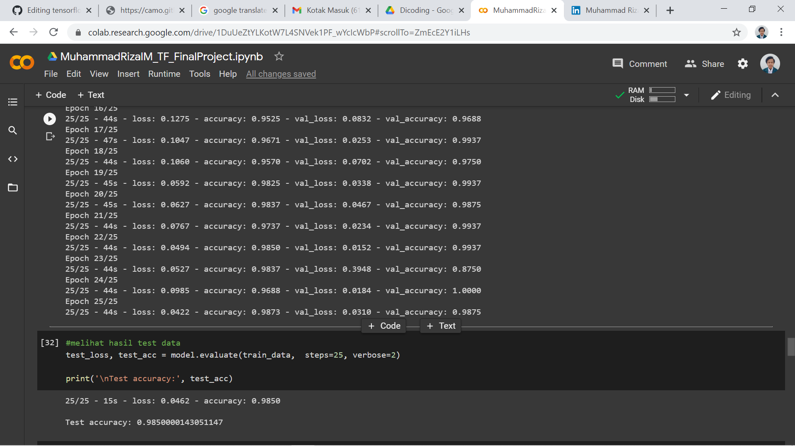
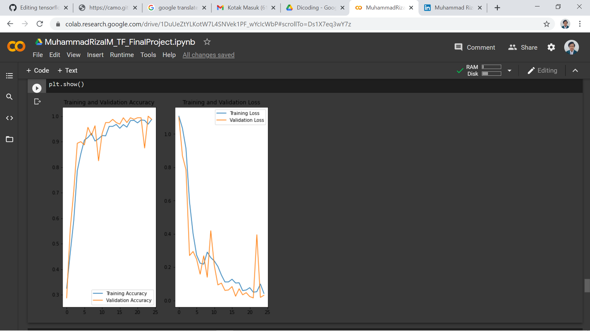
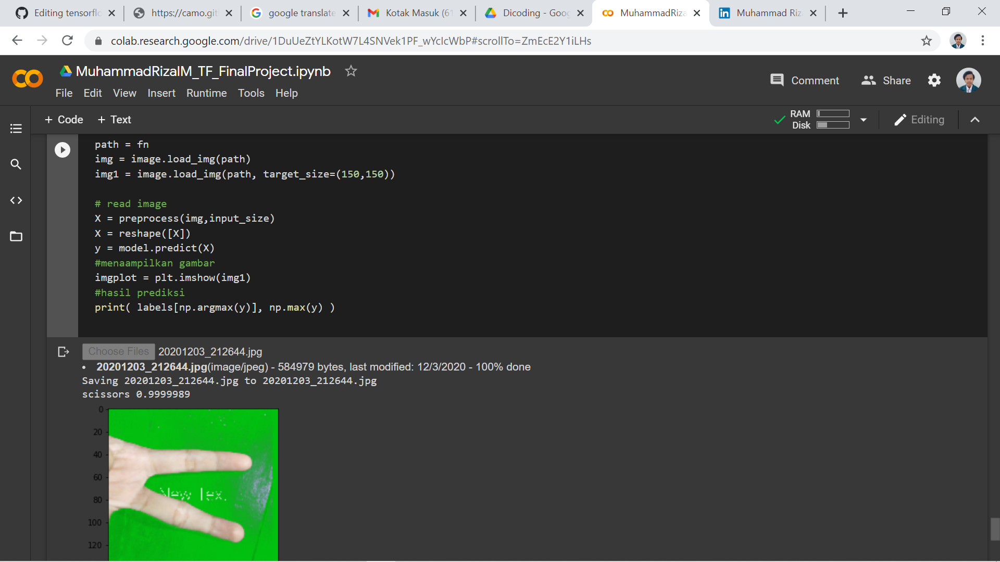

# tensorflow-rockpaperscissors
This is the final assessment of one of the beginner machine learning classes at Dicoding

## File
https://dicodingacademy.blob.core.windows.net/picodiploma/ml_pemula_academy/rockpaperscissors.zip

## SS Program

